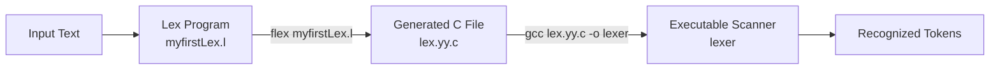

# Lab 02: Lex Program 

This lab is my first introduction to **Lex**.

## How Lex Works


## How to Run

### Step 1: Write the Lex Code

Open any text editor, such as **Notepad**, **Notepad++**, or **VS Code**.  
Write the Lex program and save the file as:

```txt
myfirstLex.txt
```

### Step 2: Rename the File

Rename the file extension from `.txt` to `.l`.

```txt
myfirstLex.txt  →  myfirstLex.l
```

> ❗ **Important:** A Lex program must be saved with the `.l` extension.

### Step 3: Open the Terminal

Then open the terminal in that folder and enter these commands one by one:

```bash
lex myfirstLex.l
gcc lex.yy.c
./a.out
```

### My First Lex Program

This program scans the input and identifies different types of tokens.

```lex
%option noyywrap

%{
#include <stdio.h>
#include <stdlib.h>
%}

digit  [0-9]
letter [A-Za-z_]
key    "int"|"main"|"for"|"if"|"else"|"return"|"while"

%%

{key} {
    printf("%s is a keyword and length is: %d\n", yytext, yyleng);
}

{letter}({letter}|{digit})* {
    printf("%s is an identifier and length is: %d\n", yytext, yyleng);
}

{digit}+ {
    printf("%s is an int number and int value is %d\n", yytext, atoi(yytext));
}

{digit}+"."{digit}+([Ee][+-]?{digit}+)? {
    printf("%s is an Exponential number\n", yytext);
}

. { }

%%

int main()
{
    yylex();
    return 0;
}
```

